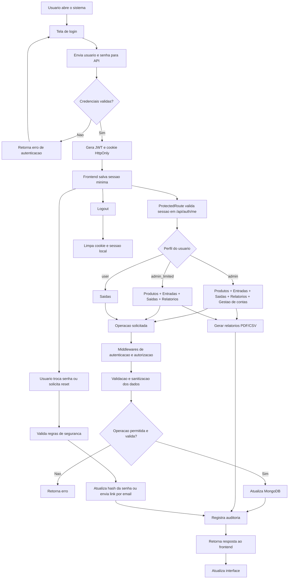

# Especificacao Tecnica do Sistema de Controle de Estoque

## 1. Visao geral

O sistema foi desenvolvido para controle de estoque com autenticacao por perfis, cadastro e manutencao de produtos, registro de entradas, registro de saidas e emissao de relatorios em PDF e CSV.

Perfis identificados no sistema:

- `admin`: gestor de contas e operacao completa
- `admin_limited`: administrador operacional
- `user`: usuario comum para retirada de itens

## 2. Tecnologias usadas

### 2.1 Frontend

- `React 18.3.1`: construcao da interface SPA
- `React Router DOM 6.26.2`: roteamento e protecao de paginas
- `Vite 5.4.21`: build e ambiente de desenvolvimento
- `@vitejs/plugin-react 4.7.0`: integracao React + Vite
- `CSS` em arquivo proprio (`frontend/src/styles.css`)
- `Fetch API`: consumo da API HTTP
- `LocalStorage`: persistencia local de sessao para UX (`role`, `username`, `token`)

### 2.2 Backend

- `Node.js` com imagens Docker baseadas em `node:20-alpine`
- `Express 4.19.2`: API REST
- `Mongoose 8.6.1`: modelagem e acesso ao MongoDB
- `MongoDB 7.x driver`: driver oficial de conexao
- `dotenv 16.4.5`: leitura de variaveis de ambiente
- `jsonwebtoken 9.0.2`: autenticacao por JWT
- `bcryptjs 2.4.3`: hash de senhas
- `helmet 8.1.0`: cabecalhos de seguranca HTTP
- `cors 2.8.5`: controle de origens permitidas
- `express-rate-limit 7.5.0`: limitacao de tentativas
- `nodemailer 6.10.1`: envio de email para recuperacao de senha
- `pdfkit 0.15.0`: geracao de PDF
- `json2csv 6.0.0-alpha.2`: exportacao CSV
- `crypto` nativo do Node.js: hash SHA-256 e geracao de token aleatorio

### 2.3 Banco de dados

- `MongoDB`
- Colecoes principais:
  - `users`
  - `products`
  - `entries`
  - `exits`

### 2.4 Infraestrutura e deploy

- `Docker`: conteinerizacao do backend
- `Fly.io`: ha arquivos `fly.toml`

## 3. Arquitetura funcional

### 3.1 Camadas do sistema

1. Frontend React
2. API REST em Express
3. Regras de autenticacao, autorizacao e validacao
4. Persistencia em MongoDB
5. Modulo de relatorios
6. Modulo de auditoria
7. Modulo de email para reset de senha

### 3.2 Modulos principais

- Autenticacao e sessao
- Gestao de usuarios
- Gestao de produtos
- Controle de entradas
- Controle de saidas
- Relatorios de estoque, entradas e saidas
- Documentacao servida pela rota `/docs`

## 4. Estrutura de dados principal

### 4.1 Usuario

Campos principais:

- `username`
- `email`
- `passwordHash`
- `passwordResetTokenHash`
- `passwordResetExpiresAt`
- `role`
- `createdAt`
- `updatedAt`

### 4.2 Produto

Campos principais:

- `name`
- `sector`
- `unit`
- `minQty`
- `qty`
- `needsRestock` (virtual)

Setores permitidos:

- `Expediente`
- `Escritorio`
- `Limpeza`
- `Copa`

Unidades permitidas:

- `Un`
- `Pct`
- `Ltr`
- `Cx`

### 4.3 Entrada

Campos principais:

- `product`
- `qty`
- `createdBy`
- `date`
- `createdAt`
- `updatedAt`

### 4.4 Saida

Campos principais:

- `product`
- `qty`
- `takenBy`
- `observation`
- `date`
- `createdAt`
- `updatedAt`

## 5. Seguranca implementada

Esta secao descreve os mecanismos de seguranca identificados no codigo.

### 5.1 Autenticacao

- Login com `JWT`
- Token com expiracao de `8 horas`
- Token aceito via `Bearer token` e tambem via cookie `access_token`
- Endpoint de validacao de sessao em `/api/auth/me`

### 5.2 Senhas

- Senhas nao sao salvas em texto puro
- Hash de senha com `bcryptjs`
- Troca de senha exige senha atual
- Sistema impede reutilizar a mesma senha na troca autenticada
- Redefinicao de senha por token temporario

### 5.3 Recuperacao de senha

- Token aleatorio gerado com `crypto.randomBytes`
- Persistencia apenas do hash SHA-256 do token
- Token com tempo de expiracao
- Resposta generica no endpoint de recuperacao para nao revelar se o email existe
- Envio por email via SMTP configurado por ambiente

### 5.4 Controle de acesso e autorizacao

- Middleware `requireAuth` para rotas autenticadas
- Middleware `requireAdmin` para a area administrativa
- Middleware `requireAccountManager` para gestao de contas
- Separacao de perfis:
  - `admin`: acesso total e gestao de usuarios
  - `admin_limited`: operacao administrativa sem gestao de contas
  - `user`: operacao de saidas
- Usuarios comuns visualizam apenas as proprias saidas

### 5.5 Protecao HTTP e API

- `helmet()` para hardening de cabecalhos HTTP
- `app.disable("x-powered-by")`
- `trust proxy` habilitado
- `CORS` restrito por lista de origens definida em `CORS_ORIGIN`
- `credentials: true` no CORS para suporte a cookie de autenticacao
- Payload JSON limitado a `10kb`

### 5.6 Protecao contra abuso e ataques automatizados

- `rate limit` no login: `10` tentativas por `15 minutos`
- `rate limit` para recuperacao/reset/troca de senha: `5` tentativas por `15 minutos`

### 5.7 Protecao contra injecao e dados maliciosos

- Sanitizacao textual com remocao de caracteres de controle
- Validacao forte de:
  - `username`
  - `email`
  - `password`
  - `productId`
  - `qty`
  - `date`
  - `sector`
  - `unit`
- Rejeicao de payload com chaves contendo `$` ou `.`
- Rejeicao de estruturas excessivamente profundas para reduzir risco de NoSQL injection
- `mongoose.set("strictQuery", true)` para consultas mais seguras

### 5.8 Regras de integridade e seguranca operacional

- Cadastro publico bloqueado
- Somente `admin` pode criar, excluir ou alterar contas
- Usuario nao pode alterar o proprio nivel de acesso
- Usuario nao pode excluir a propria conta
- O sistema impede remover ou excluir o ultimo `admin`
- Saida de estoque so ocorre se houver quantidade suficiente
- Produto possui indice unico por `name + sector`

### 5.9 Auditoria e rastreabilidade

- Registro de auditoria em log estruturado JSON
- Eventos auditados incluem:
  - login com sucesso
  - falha de login
  - logout
  - criacao, alteracao e exclusao de usuarios
  - troca e reset de senha
  - criacao de produtos
  - atualizacao e exclusao de produtos
  - criacao de entradas
  - criacao de saidas
  - geracao de relatorios
- O log inclui:
  - horario
  - acao
  - usuario
  - papel
  - IP
  - user-agent

### 5.10 Seguranca de transporte e sessao

- Cookie de autenticacao configurado com:
  - `HttpOnly`
  - `SameSite=Lax`
  - `Path=/`
  - `Secure` em producao
- O frontend envia requisicoes com `credentials: include`

## 6. Observacoes importantes de seguranca

- O sistema possui cookie HttpOnly, mas o frontend tambem salva o JWT em `localStorage` para experiencia de uso. Isso funciona, mas amplia superficie de risco em caso de XSS.
- A seguranca de email depende da configuracao correta de `SMTP_HOST`, `SMTP_PORT`, `SMTP_USER`, `SMTP_PASS` e `SMTP_FROM`.
- A restricao de CORS depende da configuracao correta da variavel `CORS_ORIGIN`.
- A seguranca do JWT depende da qualidade do segredo configurado em `JWT_SECRET`.

## 7. Fluxo funcional do sistema

### 7.1 Passo a passo resumido

1. O usuario acessa a tela de login.
2. O frontend envia credenciais para `/api/auth/login`.
3. O backend valida usuario e senha.
4. Se valido, gera JWT, grava cookie HttpOnly e retorna sessao.
5. O frontend salva dados minimos da sessao e libera o menu conforme o perfil.
6. O `ProtectedRoute` consulta `/api/auth/me` antes de renderizar paginas privadas.
7. O usuario executa operacoes permitidas pelo seu perfil.
8. Cada operacao passa por autenticacao, autorizacao, validacao e auditoria.
9. As movimentacoes alteram o estoque no MongoDB.
10. Administradores podem emitir relatorios PDF/CSV.
11. O usuario pode sair do sistema, limpando cookie e sessao local.

### 7.2 Fluxograma geral em Mermaid

## 8. Fluxo por modulo

### 8.1 Produtos

1. Admin acessa tela de produtos.
2. Sistema lista produtos por setor.
3. Admin cria, edita ou exclui produto.
4. Backend valida campos, persiste dados e audita a acao.

### 8.2 Entradas

1. Admin acessa tela de entradas.
2. Seleciona produto, quantidade e data.
3. Backend valida dados.
4. Estoque do produto e incrementado.
5. Registro de entrada e salvo.
6. Evento e auditado.

### 8.3 Saidas

1. Usuario autenticado acessa tela de saidas.
2. Seleciona produto, quantidade, data e observacao.
3. Backend valida dados e confere estoque disponivel.
4. Estoque do produto e decrementado.
5. Registro de saida e salvo com o responsavel.
6. Evento e auditado.

### 8.4 Gestao de usuarios

1. Apenas `admin` acessa a tela de usuarios.
2. Pode criar contas, alterar perfis e excluir usuarios.
3. O sistema impede autoexclusao, autoalteracao de privilegio e remocao do ultimo `admin`.
4. Toda acao e auditada.

### 8.5 Relatorios

1. Admin solicita relatorio.
2. Backend aplica filtros por setor, datas ou meses.
3. Dados sao consolidados.
4. Arquivo PDF ou CSV e gerado.
5. Download e entregue ao frontend.
6. Acao e auditada.

## 9. Variaveis de ambiente relevantes

- `MONGO_URI`
- `JWT_SECRET`
- `PORT`
- `NODE_ENV`
- `CORS_ORIGIN`
- `FRONTEND_URL`
- `RESET_TOKEN_TTL_MINUTES`
- `SMTP_HOST`
- `SMTP_PORT`
- `SMTP_USER`
- `SMTP_PASS`
- `SMTP_FROM`
- `SMTP_CONNECTION_TIMEOUT_MS`
- `SMTP_GREETING_TIMEOUT_MS`
- `SMTP_SOCKET_TIMEOUT_MS`

## 10. Conclusao

O sistema foi construido com arquitetura web moderna baseada em React no frontend, Express no backend e MongoDB na persistencia. A implementacao possui controles importantes de autenticacao, autorizacao, validacao, rate limit, auditoria, hardening HTTP, protecao contra NoSQL injection e recuperacao segura de senha. O fluxo operacional cobre desde login ate movimentacoes de estoque e emissao de relatorios.
